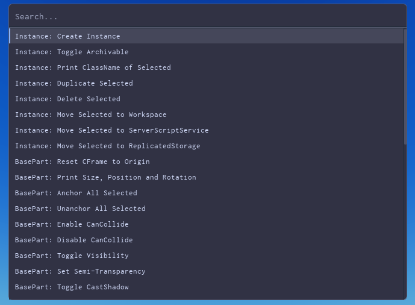
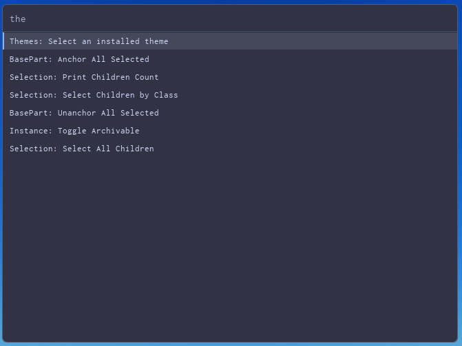
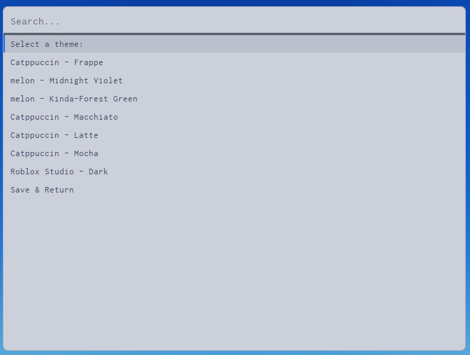

# Commandle

## What is commandle?

> A blazing-fast command palette for Roblox Studio - Inspired by VSCode

  

## What is Commandle?

Commandle brings the VSCode command-palette experience to Roblox Studio!

## Installation

Choose whichever method suits you:

- **Roblox Studio** - Install via the toolbox link (TODO)
- **GitHub Releases** - Download the latest `.rbxmx` from the [Releases](../../releases) page
- **Rojo** - Clone the repo & sync it in with Rojo

> The key bind to open is LeftShift + P, however a custom bind can be added through Roblox Studio keyboard shortcuts itself!

## Creating Custom Commands

Commandle exposes a simple API via `StudioService` so any plugin can register its own commands.

### Getting the API
```lua
local api = game:GetService("StudioService"):WaitForChild("commandle_api")
```

All bindable events live inside the `commandle_api` folder under `StudioService`.

---

## API Reference 
> The API Reference may change at any time! 

### `createCommands` - Register commands

Registers one or more commands into the palette.

| Parameter     | Type   | Description |
|---------------|--------|-------------|
| `commandType` | string | `"main"` for persistent commands, `"secondary"` for temporary ones |
| `commands`    | table  | Array of `{ title, callback }` entries |
```lua
api.createCommands:Fire("main", {
    {
        title = "My Command",
        callback = function()
            print("Hello World!")
        end
    }
})
```

---

### `pushRequest` - Push a sub-menu

Temporarily replaces the current palette view with a new list of commands. Use `popRequest` to go back.
```lua
api.pushRequest:Fire({
    { title = "Sub-option A", callback = function() end },
    { title = "Sub-option B", callback = function() end },
})
```

---

### `popRequest` - Return to previous view

Pops the most recently pushed command list off the stack, restoring the default palette.
```lua
api.popRequest:Fire()
```

---

### `openPalette` - Open the palette
```lua
api.openPalette:Fire()
```

---

### `closePalette` - Close the palette

| Parameter       | Type    | Description |
|-----------------|---------|-------------|
| `shouldAnimate` | boolean | `true` to animate the close, `false` to close instantly |
```lua
api.closePalette:Fire(true)   -- animated
api.closePalette:Fire(false)  -- instant
```

---

> This is subject to change, this is a "barbones" implementation with the wrong naming scheme.

### `requestTheme` - Register a custom theme

Adds a colour theme to Commandle's palette, making it selectable in the GUI.

**Convention for `themeName`:** `"author - ThemeName"` (e.g. `"melon - Midnight Violet"`)

| Key        | Type   | Role |
|------------|--------|------|
| `Surface0` | Color3 | Primary background (darkest) |
| `Surface1` | Color3 | Secondary background - panels, cards |
| `Surface2` | Color3 | Tertiary background - elevated elements |
| `Text`     | Color3 | Primary text |
| `Subtext0` | Color3 | Dimmed/secondary text, hints, placeholders |
| `Overlay0` | Color3 | Scrollbar or overlay tint |
| `Blue`     | Color3 | Accent colour - highlights and selection (any hue) |
```lua
api.requestTheme:Fire("melon - Midnight Violet", {
    Surface0 = Color3.fromRGB(52,  40,  80),
    Surface1 = Color3.fromRGB(36,  27,  58),
    Surface2 = Color3.fromRGB(22,  16,  38),

    Text     = Color3.fromRGB(225, 210, 255),
    Subtext0 = Color3.fromRGB(148, 120, 200),

    Overlay0 = Color3.fromRGB(14,  10,  26),

    Blue     = Color3.fromRGB(180, 120, 255),
})
```

## Attribution
Catppuccin themes - https://catppuccin.com/